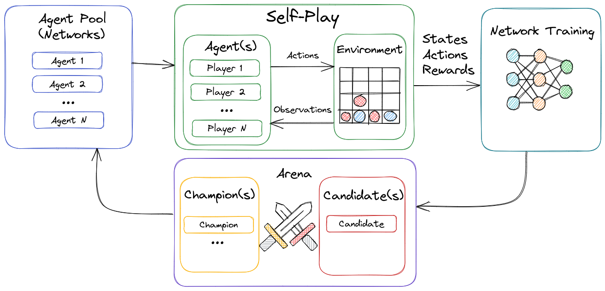

# Optima

Optima is a system that uses model-based reinforcement learning to train an agent to master an environment. It starts by exploring the environment taking random actions and learning from the outcomes. Then, it trains a deep neural network on its experience and uses its newly gained insights to explore the environment again, performing better each time. This process is repeated until Optima masters the environment. To demonstrate its ability to master its environment, this repository includes some abstract strategy board games like [Arimaa][Arimaa], [Tak][Tak], and [Quoridor][Quoridor]. Optima is based on DeepMind's [AlphaZero][AlphaZero] with [novel improvements][novel improvements] from projects like [KataGo][KataGo], and [Lc0][Lc0].



## Features

* **General** - Optima exposes traits that enable it to learn practically any game or environment, in contrast to other projects that are designed for one specific game.

* **Performant** - By utilizing modern channel based architecture in conjunction with rust's async await, thousands of games can efficiently be played in parallel on a single machine. This allows for games to be learned w/ much less computation required than the original Alpha Zero.

* **Scalable** - Optima is split into a number of processes which can each be independently scaled horizontally across multiple machines. These processes include agents interacting in the environment, training of the agents given their experience, and arenas to ensure that the best agents are chosen.

* **Multi-Agent** - Optima supports the training of many different agents that can interact together within an environment. This is invaluable for scenarios where multiple actors must work together towards a common goal. Note that while Optima supports the ability to have multiple agents, multi-agents will likely perform poorly depending on your environment. This is due to issues like reward attribution and the increase in variance from having additional agents. For more information, check out some papers covering multi-agent learning. [Multi-Agent Actor-Critic](https://arxiv.org/pdf/1706.02275.pdf)

* **Multi-Player** - Most implementations of Alpha Zero only allow for two player games. Optima abstracts out the players and allows for Optima to learn games of anywhere from 1 to N players.

* **Non-Zero-Sum** - Optima works in zero-sum as well as in non-zero-sum environments by allowing each agent to have its own set of rewards. This means that agents can choose to work both cooperatively and/or competitively as the agent attempts to maximize it's own reward.
* **Non-alternating actions** - Most implementations of Alpha Zero only allow for games where turns are alternating. Optima abstracts out the actions and allows for games which require players to take multiple actions in a row and for scenarios where turn order is dynamic.

* **Tensorflow & TensorRT** - Tensorflow combined with TensorRT allows for relatively fast neural network inference. Any NVIDIA RTX series card will allow for the best experience in self-learning and play speeds.

* **Componentized** - One of the goals of Optima is to not only allow an assortment of games to be implemented, but also to allow for the different pieces in the system to be changed. For example, a model can be changed to use pytorch vs tensorflow. This is to allow for greater flexibility and experimentation of novel ideas while having little to no impact on performance.

## Improvements

* **Arena** - An arena is introduced which allows many candidate agents to compete against other agents for a chance to be used for self-play. This allows for many different network sizes and architectures to be implemented in a single run. In addition, agents are matched against previous versions of themselves. This prevents the agent from getting stuck in a local optimum. By continually comparing the performance of the agent against previous versions, this ensures that only the most fit agent is selected for further training. This helps the agent to overcome potential issues like plateauing, regressing, or catastrophic collapse as an agent won't be selected until it overcomes its temporary shortfall. Due to the off-policy nature of the algorithms, while these candidate agents are not actively selected for self-play, they are still learning through shadowing of their champion counterparts.

* **Ancillary Heads** - While Alpha Zero incorporated a single network with two output heads, policy and value, Optima has introduced additional outputs as well as improvements. First, the policy head is shortened with its dense layers removed, this allows the policy to work directly with the logits from the convolutional layers. This means that the policy head is more general and spatially aware as all outputs, regardless of location, utilize the same weights. Second, additional heads like the moves left head allow the agent to predict how many more actions are needed until the end of the episode. This allows the agent to steer the games towards a quick and decisive win as opposed to needlessly drawing the game out.

* **Policy Softmax Temp** - Adds temperature to the policy to which acts as a regularization affect and prevents the natural feedback loop which will sharpen a random policy.

## Performance

Optima is designed with performance as a first class concern. Deep Learning and especially Reinforcement Learning are known to be extremely computationally expensive. Some have estimated a single training run of Alpha Zero could require 500k GPU Hours costing millions of dollars in compute. Other similar open source projects may require around 20k GPU hours per run. Optima has mastered these games in less than 5k GPU hours. For example, achieving perfect play on a test-bed like Connect4 is done on a single consumer grade RTX 2080 TI GPU in under an hour.

This performance is achieved through a variety of mechanisms. The first being that Optima supports pools of agents, this allows small networks that can act as weak learners which learn faster and are less costly to infer than their strong learner counter parts. Large nets acting as strong learners will not be selected until their strength has justified their inference cost. Second, improvements introduced by [KataGo][KataGo] for reducing the number of inferences per game have been implemented. By reducing the cost per game, the agents can play many more games to gain experience. There may be some further reduction through Gumbel Zero methodologies.

## Setup and Play

Optima includes some pre-trained networks that allow for immediate play. To learn from scratch, reference the [Self-Learn](#self-learn) section.

It is recommended to try running the CPU version initially due to the relative ease of setup. The GPU version requires some additional dependencies.


```bash
# clone the repo
git clone optima

# Build the package
cd ./optima && cargo build --release

# Run the client
./target/release/client play game -g <C4|Quoridor|Arimaa>
```

## Games

Optima can play a variety of games as well as allows support for implementing additional games beyond what is listed below.

* **Arimaa** - Optima powers [bot_rusty_zero][bot_rusty_zero], the [top rated][top rated] bot in [Arimaa][Arimaa]. To play against rusty, you can send commands in the bot-io channel of the [Arimaa Discord][Arimaa Discord]

* **Quoridor** - A super human level bot for the game of [Quoridor][Quoridor] is included in this repo.
* **Tak** - [Tak][Tak] introduces challenges of varying board size and a large and complex action space. This implementation is currently in progress.

* **Connect4** - Connect4 is a solved game which Optima can achieve perfect play in about an hours time. This allows for an excellent test and verification environment.

## Self-Learn

Setting up a self-learn run is fairly straightforward, a quick tutorial will be created soon. If you would like to setup your own self-learning run, please contact me and i'll walk you through it to get started.

## Use

Please note that it is **NOT** recommended to use Optima. Optima is created for personal use and is not well supported. This repository is made open source for visibility and collaboration as well as for my own learnings. There are no plans or guarantees to maintain this in the future. There are much better libs available which are more feature rich, more robust and well tested, better maintained and have communities of support around them.

As an alternative, check out [KZero][KZero] by Karel Peeters which I fully endorse!

## Install

[Installation Instructions](./INSTALL.md)

## FAQ

For commonly asked questions and troubleshooting help, please see the [FAQ](./FAQ.md)

## Acknowledgements

Huge thanks to the following amazing people and communities that helped me along the way.

* [David Wu][David Wu], for his overly well thought out responses, insights and feedback which was absolutely invaluable.
* [Arimaa Community][Arimaa Discord], for their friendliness and enthusiasm which drove a lot of motivation to complete this project.
* [DeepMind][DeepMind], for creating AlphaZero which was the impetus for me to dive deep and better understand RL w/ planning.
* [Lc0 Community][Lc0 Community], for being a fountain of knowledge.

## References

* [KataGo][KataGo]
* [Lc0][Lc0]
* [AlphaZero Cheat Sheet][AlphaZero Cheat Sheet]
* [AlphaZero pseudocode][AlphaZero pseudocode]
* [AlphaZero paper][AlphaZero paper]
* [Tensorflow Rust][Tensorflow Rust]
* [Hyperparameter Tuning][Hyperparameter Tuning]

[AlphaZero]: https://www.deepmind.com/blog/alphazero-shedding-new-light-on-chess-shogi-and-go
[AlphaZero Cheat Sheet]: https://adspassets.blob.core.windows.net/website/content/alpha_go_zero_cheat_sheet.png
[AlphaZero paper]: http://blog.lczero.org/2018/12/alphazero-paper-and-lc0-v0191.html
[AlphaZero pseudocode]: https://gist.github.com/erenon/cb42f6656e5e04e854e6f44a7ac54023
[Arimaa]: http://arimaa.com
[Arimaa Discord]: https://discord.com/invite/XTAcDjR
[bot_rusty_zero]: http://arimaa.com/arimaa/mwiki/index.php/List_of_bots
[David Wu]: https://github.com/lightvector
[DeepMind]: https://www.deepmind.com/
[Hyperparameter Tuning]: https://medium.com/oracledevs/lessons-from-alpha-zero-part-6-hyperparameter-tuning-b1cfcbe4ca9a
[KataGo]: https://github.com/lightvector/KataGo
[KZero]: https://github.com/KarelPeeters/kZero
[Lc0]: https://lczero.org/
[Lc0 Community]: https://lczero.org/about/community/
[novel improvements]: https://arxiv.org/abs/1902.10565
[Quoridor]: https://boardgamegeek.com/boardgame/624/quoridor
[Tensorflow Rust]: https://github.com/tensorflow/rust
[Tak]: https://ustak.org/
[top rated]: http://arimaa.com/arimaa/gameroom/topRatedBots.cgi?r=1